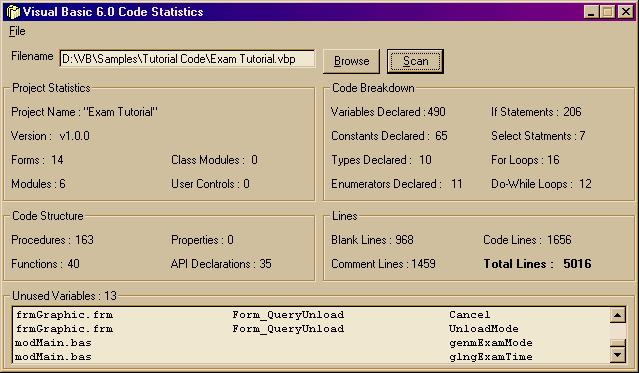



## Code Statistics / Unused Variable Finder

### Description

This will get various statistics about your code, from how many blank lines you have, to how many variables you have declared. This is basically the same as my last version (Code Statistics v3), with a few improvements on the code scanner, and a new feature that lists the amount of variables you declared but never used. Just a note though, it will also list any unused event parameters. Let me know what you think - Eric
 
### More Info
 

             |
---                |---
**Submitted On**   |2002-04-10 20:07:34
**By**             |[Eric O'Sullivan](https://github.com/Planet-Source-Code/PSCIndex/blob/master/ByAuthor/eric-o-sullivan.md)
**Level**          |Advanced
**User Rating**    |4.9 (73 globes from 15 users)
**Compatibility**  |VB 6\.0
**Category**       |[String Manipulation](https://github.com/Planet-Source-Code/PSCIndex/blob/master/ByCategory/string-manipulation__1-5.md)
**World**          |[Visual Basic](https://github.com/Planet-Source-Code/PSCIndex/blob/master/ByWorld/visual-basic.md)
**Archive File**   |[Code\_Stati716114132002\.zip](https://github.com/Planet-Source-Code/eric-o-sullivan-code-statistics-unused-variable-finder__1-33474/archive/master.zip)

